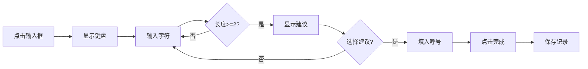

# 内嵌式软键盘功能

## 概述

为卫星跟踪界面的呼号记录器添加了专用的内嵌式软键盘，解决了系统输入法遮挡搜索建议的问题。

## 问题背景

在使用系统输入法输入呼号时，会出现以下问题：

1. **遮挡问题**: 系统输入法弹出时会遮挡呼号搜索建议
2. **布局不一致**: 不同设备的输入法布局差异大
3. **多余按键**: 系统输入法包含大量呼号输入不需要的按键
4. **输入延迟**: 系统输入法可能存在响应延迟

## 解决方案

### 内嵌式软键盘

设计了一个专用的内嵌式软键盘，具有以下特点：

```
┌─────────────────────────────────────┐
│ Q  W  E  R  T  Y  U  I  O  P       │  ← 字母键(第1行)
│  A  S  D  F  G  H  J  K  L         │  ← 字母键(第2行)
│   Z  X  C  V  B  N  M              │  ← 字母键(第3行)
│ 1  2  3  4  5  6  7  8  9  0       │  ← 数字键
│ [←退格]              [完成]         │  ← 功能键
└─────────────────────────────────────┘
```

### 核心优势

| 特性 | 系统输入法 | 内嵌键盘 |
|------|-----------|---------|
| 搜索建议可见性 | ❌ 被遮挡 | ✅ 始终可见 |
| 布局一致性 | ❌ 设备差异 | ✅ 完全一致 |
| 按键数量 | ❌ 过多 | ✅ 精简 |
| 响应速度 | ⚠️ 可能延迟 | ✅ 即时响应 |
| 自动大写 | ⚠️ 需手动 | ✅ 自动转换 |

## 技术实现

### 1. 组件架构

```
SimpleCallsignRecorder (呼号记录器)
    ├── OutlinedTextField (只读输入框)
    ├── SearchSuggestions (搜索建议)
    └── EmbeddedKeyboard (内嵌键盘)
        ├── KeyboardRow (字母行 x3)
        ├── KeyboardRow (数字行 x1)
        └── FunctionKeys (功能键)
```

### 2. 状态管理

```kotlin
// 输入文本
var inputText by remember { mutableStateOf("") }

// 搜索建议
var searchSuggestions by remember { mutableStateOf<List<String>>(emptyList()) }
var showSuggestions by remember { mutableStateOf(false) }

// 键盘显示状态
var showKeyboard by remember { mutableStateOf(false) }
```

### 3. 核心逻辑

```kotlin
// 处理按键输入
fun handleKeyPress(key: String) {
    inputText += key
    if (inputText.length >= 2) {
        searchSuggestions = callsignMatcher.search(inputText, limit = 10)
        showSuggestions = searchSuggestions.isNotEmpty()
    }
}

// 处理退格
fun handleBackspace() {
    if (inputText.isNotEmpty()) {
        inputText = inputText.dropLast(1)
        // 更新搜索建议
    }
}

// 保存呼号
fun saveCallsign() {
    if (inputText.isNotBlank()) {
        dataStore.saveCallsign(CallsignRecord(...))
        inputText = ""
        showKeyboard = false
    }
}
```

### 4. 禁用系统输入法

```kotlin
OutlinedTextField(
    value = inputText,
    onValueChange = { }, // 空函数
    readOnly = true, // 只读模式
    modifier = Modifier.clickable {
        showKeyboard = !showKeyboard
    }
)
```

## 使用流程

### 基本流程



### 详细步骤

1. **打开键盘**: 点击输入框
2. **输入呼号**: 使用键盘输入字母和数字
3. **查看建议**: 输入≥2字符后自动显示
4. **选择建议**: 点击建议直接填入（可选）
5. **保存记录**: 点击"完成"或"✓"按钮

## 文件清单

### 新增文件

```
app/src/main/java/com/bh6aap/ic705Cter/ui/components/
└── EmbeddedKeyboard.kt                    # 内嵌键盘组件

docs/
├── embedded-keyboard-feature.md           # 功能说明文档
├── embedded-keyboard-usage.md             # 使用说明文档
└── README-embedded-keyboard.md            # 本文档

CHANGELOG.md                               # 更新日志
```

### 修改文件

```
app/src/main/java/com/bh6aap/ic705Cter/
└── SatelliteTrackingActivity.kt           # 卫星跟踪界面
    └── SimpleCallsignRecorder()           # 呼号记录器组件
```

## 测试清单

### 功能测试

- [ ] 所有字母键正常工作
- [ ] 所有数字键正常工作
- [ ] 退格键正常删除字符
- [ ] 完成键正常保存记录
- [ ] 搜索建议正常显示
- [ ] 点击建议正常填入
- [ ] 拖拽功能正常工作
- [ ] 保存按钮正常工作

### UI测试

- [ ] 键盘展开/收起动画流畅
- [ ] 搜索建议不被遮挡
- [ ] 深色模式显示正常
- [ ] 浅色模式显示正常
- [ ] 小屏幕设备显示正常
- [ ] 大屏幕设备显示正常

### 性能测试

- [ ] 快速连续输入响应正常
- [ ] 搜索建议更新及时
- [ ] 内存占用正常
- [ ] CPU占用正常

## 已知限制

1. **字符限制**: 仅支持A-Z字母和0-9数字
2. **布局固定**: 当前版本不支持自定义布局
3. **无手势**: 暂不支持滑动输入等手势操作
4. **无振动**: 暂未添加触觉反馈

## 未来改进

### 短期计划

- [ ] 添加触觉反馈（振动）
- [ ] 优化按键动画效果
- [ ] 添加按键音效（可选）

### 长期计划

- [ ] 支持自定义键盘布局
- [ ] 添加常用呼号前缀快捷键
- [ ] 支持手势输入
- [ ] 支持语音输入

## 参考资料

### 相关文档

- [功能说明文档](./embedded-keyboard-feature.md)
- [使用说明文档](./embedded-keyboard-usage.md)
- [更新日志](../CHANGELOG.md)

### 相关代码

- [EmbeddedKeyboard.kt](../app/src/main/java/com/bh6aap/ic705Cter/ui/components/EmbeddedKeyboard.kt)
- [SatelliteTrackingActivity.kt](../app/src/main/java/com/bh6aap/ic705Cter/SatelliteTrackingActivity.kt)

### 设计参考

- [Material Design 3 - Text Fields](https://m3.material.io/components/text-fields)
- [Material Design 3 - Buttons](https://m3.material.io/components/buttons)
- [Android Keyboard Design Guidelines](https://developer.android.com/design/ui/mobile/guides/components/keyboard)

## 反馈与支持

如有问题或建议，请通过以下方式联系：

- **GitHub Issues**: https://github.com/bh6aap/ic705controler/issues
- **Email**: 1065147896@qq.com
- **呼号**: BH6AAP

---

**版本**: v3.5.6  
**更新日期**: 2025-01-XX  
**作者**: BH6AAP
